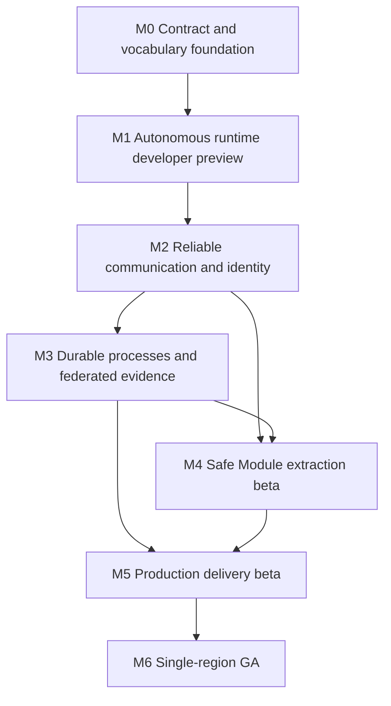

# Autonomous Services Roadmap

Status: proposed

This roadmap turns Lenso's existing service-ready Provider model into a gradual
path toward Autonomous Services. It records sequencing and acceptance gates; it
does not authorize implementation or choose infrastructure products that still
need focused design work.

The terminology in this document follows [`CONTEXT.md`](../../CONTEXT.md). The
architectural boundaries are recorded in [`docs/adr`](../adr/).

## Destination

A small or midsize product team can begin with one modular Lenso application,
prove that a Module boundary is ready, and extract it into an Autonomous Service
without rewriting its business contract or losing operational evidence.

The first complete product supports roughly three to twenty independently
released Services in one Operating Region. Each Service owns its data, runtime,
Workloads, contracts, reliability, and release cadence. The System Plane
coordinates and explains the System but is never required to carry established
business traffic.

## Product proof

The roadmap is complete when this path is real rather than aspirational:

```text
linked support-ticket Module
    -> extraction readiness report
    -> reviewable Extraction Plan
    -> Autonomous support Service with API, Worker, and Migration Workloads
    -> direct Service Contract calls and reliable Event Contracts
    -> support SLA Workflow with timeout and compensation
    -> Federated Runtime Story across the participating Services
    -> one immutable Service Release promoted through staging to production
    -> policy-gated Cutover with a demonstrated rollback
```

The existing support-ticket, support-sla, system-release, Operator, and Runtime
Console fixtures should be extended into this tracer bullet instead of creating
an unrelated demo family.

## Starting point

Lenso already has substantial service-facing machinery. The roadmap extends it
rather than renaming it as new work.

| Existing capability | Keep and extend | Missing autonomous capability |
| --- | --- | --- |
| Shared Module manifests for linked and remote sources | Preserve Module identity across extraction | Service-owned contracts independent of one Host |
| Remote Module HTTP/JSON and gRPC protocol | Retain as the Provider Protocol | Direct Autonomous Service HTTP/gRPC contracts and clients |
| Host-owned auth, proxy policy, retries, runtime queues, Outbox, and Story evidence | Preserve for Provider mode | Service-owned runtime, identity, Store, Outbox, Inbox, and Story Segments |
| Transactional Postgres Outbox and in-process relay | Reuse as the local publication source | Transport Adapters, durable Inbox, replay, and broker delivery evidence |
| `lenso.workspace.json` and `lenso service dev` | Reuse process startup and readiness knowledge | A clusterless multi-Service System Sandbox |
| `lenso.system.json`, graph, drift, release trains, and runbooks | Evolve into a federated System contract | Autonomous topology, Contract Versions, reliability, and regional evidence |
| Service packages, release plans, promotion, Kubernetes export, and Operator | Reuse delivery adapters and observations | Immutable multi-Workload Service Releases and Policy Packs |
| Runtime Story, Remote Calls, Technical Operations, and OpenTelemetry enrichment | Keep the business-evidence model | Service-owned Story Segments and Federated Runtime Stories |
| Generated OpenAPI, JSON Schema, Protobuf, lints, and release gates | Keep generated artifacts authoritative | Cross-Service compatibility and can-I-deploy evidence |
| Machine-readable plans and agent task artifacts | Apply the same interaction model everywhere | Bounded extraction, release, incident, and contract-evolution workflows |

The current architecture intentionally has no external broker, peer Service
runtime, distributed workflow engine, production Workload Identity, or
federated evidence transport. Those are real gaps; Kubernetes YAML, another
service scaffold, or another Console summary is not the next architectural gap.

## Dependency map



Contract generation, structured CLI output, Approval Boundaries, documentation,
failure tests, and backward compatibility are cross-cutting requirements in
every milestone.

## Milestone 0: contract and vocabulary foundation

Priority: P0

Goal: make Provider and Autonomous Service semantics representable without
breaking the current Provider path.

### Feature slices

1. Define the next Service and System contract shapes.
   - A Service is a logical delivery boundary, not one process.
   - Workloads describe API, Worker, Migration, or future process roles.
   - Modules, Service Stores, Service Contracts, Event Contracts, Reliability
     Contracts, Tenancy Mode, Config Contracts, and regions belong to the
     logical Service declaration.
   - A Provider remains the Host-managed compatibility mode.
2. Design a versioned migration from the current `lenso.service.v1` and
   `lenso.system.v1` artifacts.
   - Existing files continue to parse.
   - CLI and Console output names the old semantics accurately without forcing
     users to rewrite projects immediately.
   - Generated schemas and fixtures prove both old and new forms.
3. Define common context contracts.
   - Story Context, trace context, Service Principal, Delegated Actor Context,
     Tenant Context, Deadline, Idempotency Key, causation, and region metadata.
   - Security-sensitive actor and tenant claims are verifiable context, not
     trusted OpenTelemetry Baggage.
4. Extend contract tooling.
   - Versioned OpenAPI, Protobuf, Event Contract, Config Contract, and
     Reliability Contract artifacts.
   - Compatibility diff categories: safe, needs attention, breaking, blocked.
   - Producer and Consumer references in the System graph.
5. Make all new plans agent-safe.
   - Stable JSON, dry-run, deterministic diff, error codes, next actions, and
     Approval Boundaries are part of the command contract from the first slice.

### Exit gate

- The same System graph can contain a Host, Provider, and Autonomous Service
  without overloading one word for all three.
- Current Provider fixtures pass unchanged or through an explicit compatibility
  adapter.
- Generated artifacts are authoritative and freshness-checked.
- No new runtime behavior is hidden inside this contract-only milestone.

## Milestone 1: autonomous runtime developer preview

Priority: P0

Goal: run two Services directly on a laptop without a Host, Kubernetes, or an
external broker in their Data Plane.

### Feature slices

1. Add an Autonomous Service runtime profile.
   - Compose API, Worker, and Migration Workloads from one Service definition.
   - Give the Service its own Store, runtime queues, Outbox, health model,
     Config Contract, and local Story Segment store.
   - Keep business behavior in Modules; the runtime remains platform behavior.
2. Add direct Service Contracts.
   - Contract-first HTTP and gRPC server bindings.
   - Generated Service Clients that preserve the underlying protocol.
   - Standard errors, Deadline propagation, Idempotency Keys, and initial Call
     Policy enforcement.
3. Add discovery foundations.
   - Stable Service References and an Endpoint Resolver interface.
   - Static and local-process resolvers first.
   - Cache the last valid endpoint state so System Plane availability is not a
     request-path dependency.
4. Deliver the System Sandbox.
   - Evolve `lenso service dev` toward `lenso system dev` for multiple Workloads.
   - Local Workload Identity, isolated Service Stores, controlled time, local
     transport, health waiting, logs, and cleanup.
   - Repeatable Failure Scenarios for timeout, slow dependency, crash, overload,
     and partial unavailability.
5. Extend the support example into two directly communicating Services while
   leaving the current Provider smoke intact.

### Exit gate

- Service A calls Service B directly through a generated client.
- Stopping the Runtime Console and System Plane does not interrupt the call.
- Deadline and no-unsafe-retry rules are visible in evidence and tests.
- The entire proof runs on a developer machine without Kubernetes or an
  external broker.

## Milestone 2: reliable communication and identity

Priority: P0

Goal: make asynchronous delivery, production identity, and context propagation
safe enough to support independently operated Services.

### Feature slices

1. Define the Event Envelope and asynchronous contract artifacts.
   - Use CloudEvents-compatible identity and metadata where it fits.
   - Generate a protocol-neutral event API artifact; evaluate AsyncAPI as the
     external representation.
   - Keep broker topic, partition, offset, and vendor settings out of Module
     contracts.
2. Add a Transport Adapter SPI.
   - The System Sandbox adapter remains dependency-free.
   - Select one production broker adapter only after a focused decision on
     delivery semantics, operations, and target-user burden.
3. Complete reliable publication and consumption.
   - Service-owned transactional Outbox publication.
   - Durable Inbox and deduplication.
   - At-least-once delivery with exactly-once business effects through
     idempotency.
   - Retry classification, dead-letter state, replay, poison-event handling,
     retention, and operator evidence.
4. Add Workload Identity providers.
   - Stable Service Principals and short-lived credentials.
   - Local development provider plus production integrations selected through a
     separate design decision; SPIFFE compatibility is the preferred standard
     boundary.
   - mTLS or equivalent authenticated transport without binding identity to IP,
     pod, or hostname.
5. Add Delegated Actor Context and Tenant Context.
   - Audience-limited, signed delegation instead of forwarding browser tokens.
   - Local authorization at the receiving Service.
   - `none`, `optional`, and `required` Tenancy Modes and explicit background
     work scoping.
6. Finish Call Policy enforcement.
   - End-to-end Deadline, idempotency-aware retry, circuit breaker, bulkhead,
     overload rejection, and explicit business fallback.

### Exit gate

- A Service can be restarted or unavailable during event delivery without
  losing an event or repeating its business effect.
- Duplicate, delayed, and reordered delivery are covered by Failure Scenarios.
- A receiving Service authenticates the caller and verifies delegated actor and
  tenant scope without asking a central Host.
- Switching from the local Transport Adapter to the first production adapter
  does not change Event Contracts or Module code.

## Milestone 3: durable processes and federated evidence

Priority: P1

Goal: coordinate long-running business outcomes while preserving Lenso's
business-first observability across Service boundaries.

### Feature slices

1. Resolve the workflow runtime strategy.
   - Decide whether the first engine extends `platform-runtime`, adapts an
     external durable engine, or uses an embedded default plus external adapter.
   - Preserve Lenso-owned workflow contracts and Story semantics regardless of
     the engine decision.
2. Add Durable Workflow and Saga contracts.
   - Durable instance and step identity.
   - Commands, events, timers, retries, child workflows, and compensation.
   - Workflow versioning and rules for in-flight instances.
   - Pause, resume, retry, cancel, terminate, and human intervention with
     Approval Boundaries.
3. Federate Runtime Stories.
   - Propagate Story Context across HTTP, gRPC, events, and workflow steps.
   - Persist Service-owned Story Segments.
   - Choose a delayed-tolerant aggregation protocol that does not make the
     Console or System Plane part of Service execution.
   - Correlate OpenTelemetry traces, metrics, and logs without treating sampled
     telemetry as durable business evidence.
4. Add Reliability Contracts and profiles.
   - Development, standard, and critical baselines.
   - Dependency criticality, Degraded Modes, queue and workflow backlog,
     startup/readiness/liveness meaning, SLOs, and error budgets.
5. Extend Runtime Console.
   - Cross-Service story timeline and workflow graph.
   - Inbox, Outbox, retry, dead-letter, compensation, degraded dependency, and
     identity evidence.
   - Local Segment gaps are visible rather than silently hidden.

### Exit gate

- A support SLA process crosses at least two Services, survives restarts, times
  out deterministically, and executes compensation safely.
- Operators can explain the business outcome from a Federated Runtime Story and
  drill into technical telemetry when available.
- Removing the aggregation backend does not stop workflow execution or local
  evidence capture.

## Milestone 4: safe Module extraction beta

Priority: P1

Goal: make gradual extraction the hero workflow rather than forcing teams to
design a distributed migration by hand.

### Feature slices

1. Add extraction readiness analysis.
   - Cross-Module imports and public calls.
   - Cross-table access and transaction boundaries.
   - Module-owned migrations and data volume.
   - Missing HTTP, gRPC, Event, Config, Reliability, or admin contracts.
   - Runtime functions, schedules, Console surfaces, and Story display metadata.
2. Generate an Extraction Plan.
   - Proposed Service, Workloads, Stores, Service References, clients, contracts,
     and System graph changes.
   - Compatibility, backfill, coexistence, verification, Cutover, and rollback
     phases.
   - Explicit blocks for boundaries that are not mature enough to extract.
3. Add generated extraction scaffolds.
   - Preserve Module names, capabilities, operation names, Event Contracts,
     Console identity, and Story titles.
   - Replace in-process calls with generated Service Clients only after contract
     approval.
4. Add data movement rails.
   - Expand-first schema changes, resumable backfill, reconciliation checks,
     ownership transfer, and rollback constraints.
   - Dual-run or shadow comparison only where a focused design proves its safety.
   - No automatic irreversible migration.
5. Add Cutover evidence.
   - Compare linked and Autonomous behavior with the same business scenarios.
   - Require Compatibility Verification, Policy Evidence, Story comparison, and
     a human Approval Boundary.

### Exit gate

- The support-ticket proof moves from linked execution to an Autonomous Service
  without changing its public Module identity.
- A failed Cutover returns authority to the linked implementation through a
  documented and tested rollback.
- Direct table access, missing contracts, or incompatible consumers block the
  plan before data movement begins.

## Milestone 5: production delivery beta

Priority: P1

Goal: promote one verified multi-Workload Service Release through real
environments with supply-chain, policy, configuration, reliability, and rollback
evidence.

### Feature slices

1. Define the immutable Service Release.
   - Bind Service and Module versions, Workload image digests, Contract Versions,
     Config Contract, migration and workflow compatibility, Reliability Contract,
     verification evidence, SBOM, provenance, signatures, and rollback metadata.
   - Keep environment values and Secret values outside the artifact.
2. Extend release and Promotion flows.
   - Build once and promote identical digests.
   - Compatibility-aware can-I-deploy checks.
   - Contract deprecation and retirement evidence.
   - Expand/contract migration gates and rollback constraints.
3. Add Config Revisions and Secret References.
   - Validation, impact analysis, staged activation, rollback, and drift.
   - Local, orchestrator, Vault, and cloud Secret Providers remain adapters.
4. Add deterministic Policy Packs.
   - Same engine and result locally, in CI, and through the System Plane.
   - Production rules for contracts, resilience, identity, tenancy, provenance,
     migrations, reliability, environment verification, and dependency state.
   - Explainable failures and concrete remediation commands.
5. Evolve Deployment Adapters.
   - Reuse Kubernetes export and the Lenso Operator without making Kubernetes a
     requirement.
   - Preserve local and externally managed targets.
   - Select any first PaaS adapter through a separate product decision.
6. Add Edge Contracts and Gateway Adapters.
   - Public routes, versions, auth, CORS, rate intent, internal-only operations,
     and deprecation.
   - Generate or validate local and production Gateway configuration; do not
     build a production proxy.
7. Enforce reliability during rollout.
   - Canary evidence, error-budget checks, Degraded Mode behavior, safe scaling,
     and automatic rollback triggers bounded by policy.

### Exit gate

- The same signed Service Release digests move from staging to production.
- A Policy Pack blocks an unsafe contract, migration, identity, or reliability
  change locally before deployment.
- A canary failure produces explainable evidence and a tested rollback.
- Existing Services continue running while the System Plane is unavailable.

## Milestone 6: single-region general availability

Priority: P2

Goal: make the supported path boring, upgradeable, documented, and defensible
for the target three-to-twenty-Service System.

### Feature slices

1. Backward compatibility and upgrades.
   - Provider-mode compatibility matrix.
   - Manifest and state migrations across released CLI/runtime versions.
   - Rolling upgrade and mixed-version tests.
2. Contract lifecycle completion.
   - Consumer inventory, deprecation windows, parallel major versions, and safe
     Contract Retirement.
3. Failure and recovery matrix.
   - Process, network, broker, Store, identity provider, telemetry, Console,
     System Plane, deployment, and migration failures.
   - Backup, restore, and single-region active-passive disaster recovery drills.
4. Scale and performance characterization.
   - Three, ten, and twenty Service reference systems.
   - Client, resolver, transport, Inbox/Outbox, workflow, Story, and Console
     overhead budgets.
5. Security and supply-chain review.
   - Threat models for Service identity, delegation, event replay, extraction,
     release signing, Secrets, tenancy, admin actions, and policy bypass.
6. Complete agent-ready rails.
   - Public skills for Service authoring, extraction, contract evolution,
     Workflow design, release, incident diagnosis, and API client use.
   - Human and agent workflows consume the same plans, gates, and evidence.
7. Public story and documentation.
   - Keep the headline as an agent-ready modular app framework.
   - Demonstrate the evolution path rather than claiming a generic enterprise
     microservice platform.

### Exit gate

- The complete product proof runs from a fresh starter and released packages.
- Supported mixed-version and failure scenarios pass in CI and an Environment
  Verification lane.
- Upgrade, rollback, disaster recovery, security, and operations docs match the
  released behavior.
- No feature requires a hidden central Data Plane dependency.

## Cross-repository ownership

`framework/` is a container directory, not a monorepo. Each slice must land in
the repository that owns the contract or runtime behavior.

| Repository | Primary roadmap ownership |
| --- | --- |
| `lenso` | Core contracts, Autonomous Service runtime, context, Store/Outbox/Inbox primitives, Workflow semantics, Story Segments, admin APIs, architecture checks |
| `lenso-cli` | Service/System manifests, System Sandbox, extraction plans, compatibility checks, releases, Policy Packs, deployment and Gateway generation |
| `lenso-runtime-console` | Federated topology, Stories, workflows, communication evidence, contracts, config, policies, reliability, release and Cutover UI |
| `lenso-examples` | Support tracer bullet, Failure Scenarios, extraction smoke, production-adapter fixtures, fresh-starter proof |
| `lenso-auth-module` | Actor/session integration needed to issue bounded Delegated Actor Context; not Workload Identity infrastructure |
| `lenso-organization-module` | Tenant lifecycle and membership; not Tenant Context propagation in platform core |
| `lenso-release` | Repository-family package/version orchestration where it intersects immutable Service Release artifacts |
| `lenso-catalog-worker` | Catalog metadata when Module releases need to declare Autonomous Service compatibility |
| `lenso-site` | Public concepts, tutorials, reference, positioning, and migration guides after contracts stabilize |

Cross-repository work must follow dependency order: contracts and generated
artifacts first, runtime and CLI second, Console and examples third, public docs
last. Official catalog snapshots must remain aligned with the catalog worker.

## Decisions still required before implementation

The grilling session fixed product and architecture boundaries. It deliberately
did not choose the following implementation details:

1. Version and migration design for the next Service and System manifests.
2. Exact CloudEvents and AsyncAPI mapping for Lenso Event Contracts.
3. First production broker adapter and its operational support level.
4. Embedded versus external durable workflow engine strategy.
5. Production Workload Identity providers and Delegated Actor Context token
   format.
6. Federated Story Segment transport, retention, and aggregation model.
7. Policy Pack language and engine: native rules, CEL, Rego, or another bounded
   representation.
8. OCI layout, provenance, and signing representation for Service Releases.
9. First non-Kubernetes production Deployment Adapter, if any.
10. Safe data coexistence and Cutover strategies supported in the first
    Extraction Plan.

Each is a focused design ticket. None should be silently decided inside a broad
implementation PR.

## Explicit non-goals

- A Lenso-owned message broker.
- A Lenso-owned distributed service registry.
- A production reverse proxy, WAF, or global traffic network.
- A certificate authority or Secret store.
- A container scheduler or replacement for Kubernetes and PaaS platforms.
- Distributed ACID transactions or cross-Service table access.
- Forwarding browser bearer tokens to Providers or Autonomous Services.
- Multi-region active-active behavior in the first generation.
- Hundreds-of-Service, multi-cluster enterprise governance.
- Mandatory Kubernetes, service mesh, external broker, or hosted System Plane
  for ordinary local development.

## Recommended first implementation slice

Start with **Autonomous Service Contract Foundation**, not a broker adapter or
Operator expansion.

The slice should:

1. Specify the versioned Service, Workload, Provider, Service Reference, Service
   Contract, Reliability Contract, and System graph shapes.
2. Generate JSON Schemas and compatibility fixtures.
3. Teach the CLI to parse, lint, diff, and render both the current Provider form
   and the new Autonomous Service form.
4. Show the distinction in `lenso system graph` and machine-readable output.
5. Add no new network runtime and preserve all current Provider behavior.

This is the narrowest tracer that unlocks every later milestone without
pretending the hard runtime decisions have already been made.

## Standards alignment

These standards are reference boundaries, not mandatory infrastructure:

- [CloudEvents](https://github.com/cloudevents/spec/blob/main/cloudevents/spec.md)
  for transport-independent event identity and metadata.
- [AsyncAPI](https://www.asyncapi.com/docs/tutorials/getting-started/asyncapi-documents)
  as a candidate machine-readable event API artifact.
- [SPIFFE](https://spiffe.io/docs/latest/spiffe-about/spiffe-concepts/) for
  portable Workload Identity and trust-domain semantics.
- [OpenTelemetry context propagation](https://opentelemetry.io/docs/concepts/context-propagation/)
  for technical trace correlation, with Story Context and authorization claims
  kept distinct from untrusted Baggage.
- [Kubernetes Gateway API](https://gateway-api.sigs.k8s.io/docs/introduction/)
  as one portable Edge Contract target.
- [Sigstore Cosign](https://docs.sigstore.dev/cosign/signing/signing_with_containers/)
  as a candidate for digest-bound signatures and attestations.
- [Temporal](https://docs.temporal.io/) and
  [Dapr Workflow](https://docs.dapr.io/developing-applications/building-blocks/workflow/workflow-overview/)
  as comparison points for durable execution behavior, not automatic engine
  choices.
