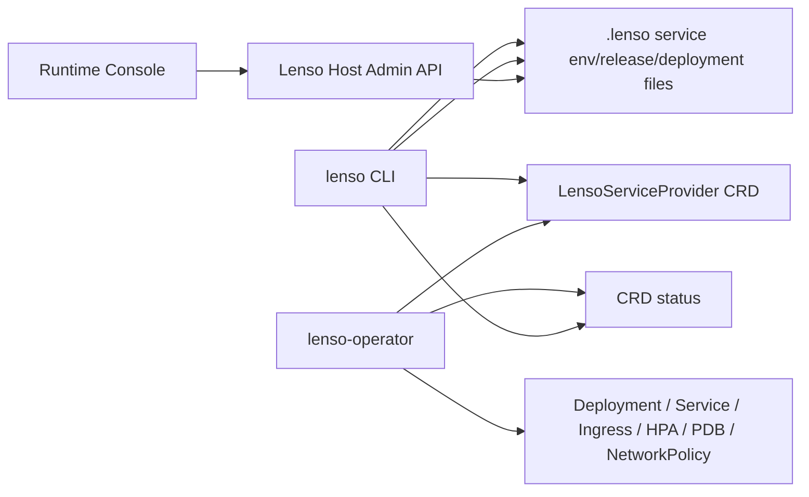

# Lenso Operator Core V16 Design

## Summary

V16 turns the V15 Kubernetes-ready service delivery path into a Kubernetes-native reconciliation path.

V15 can generate Kubernetes YAML and read rollout observations. V16 adds a first Lenso Operator core:

- a `LensoServiceProvider` Kubernetes custom resource;
- a Rust operator/controller that reconciles that resource into Kubernetes workload objects;
- CLI export/status commands that can target the operator CRD instead of raw Deployment YAML;
- Console visibility for operator-managed services, CRD conditions, release drift, and reconciliation next actions.

This is not a move toward service mesh ownership. Lenso still owns service/module/release semantics. Kubernetes owns process scheduling, rollout state, networking, and replica availability. The host still owns auth, capability checks, runtime queues, retries, Outbox, Runtime Story, Remote Calls, and Technical Operations.

## Why V16

The V15 model is useful but still operator-driven:

1. `lenso service deploy export` writes manifests.
2. A human or CI job applies the manifests.
3. `lenso service deploy status` reads cluster state.
4. Console displays cached deployment observations.

That is enough for a reviewable production path, but it is not yet a framework-level deployment control plane. The missing piece is reconciliation: a durable desired-state object in Kubernetes that continuously owns the provider process shape.

V16 should introduce that ownership carefully. The operator should manage the service provider process and deployment-side resources only. It must not own Lenso host runtime tables, module installation semantics, browser auth, service mesh routing, distributed transactions, or service-to-service policy.

## Product Framing

V16 product line:

> Lenso services can now be Kubernetes-native: define one `LensoServiceProvider`, let the operator reconcile the provider process, and keep Host/Console observability connected to service releases and module runtime evidence.

User-facing terms:

- **Service Provider**: out-of-process backend providing one or more modules.
- **Module**: business capability installed into a Lenso host.
- **Release**: Lenso service package/manifest transition applied to a host environment.
- **Deployment Environment**: named target like `staging` or `prod`.
- **Operator Managed**: deployment resources are reconciled from a `LensoServiceProvider` CRD.

Avoid calling this a full platform, mesh, or orchestrator.

## Scope

### In V16

- Add `LensoServiceProvider` CRD, version `lenso.dev/v1alpha1`.
- Add a Rust `lenso-operator` binary/crate.
- Reconcile CRD spec into:
  - `Deployment`;
  - `Service`;
  - optional `Ingress`;
  - optional `HorizontalPodAutoscaler`;
  - optional `PodDisruptionBudget`;
  - optional `NetworkPolicy`.
- Write CRD status with:
  - `ready`, `progressing`, `failed`, `unknown`;
  - observed release id;
  - observed image;
  - replica counts;
  - conditions;
  - last transition time;
  - manifest URL.
- Add CLI operator export/status:
  - `lenso operator export-crd`;
  - `lenso service deploy export <provider> --env prod --target operator`;
  - `lenso service deploy status <provider> --env prod --source operator --write-state`.
- Extend Host admin data and Console to show operator source/status when `.lenso/service-deployments.json` contains operator observations.
- Add support-ticket operator proof docs and sample CRD.

### Not In V16

- Helm chart engine.
- Admission webhooks.
- Cert-manager integration.
- Cloud account provisioning.
- Multi-cluster orchestration.
- Service mesh integration.
- Gateway ownership.
- Distributed transactions.
- CRDs for individual modules.
- Automatic module install from Kubernetes.
- Operator writing Lenso host runtime data.
- Operator reading browser bearer tokens.

## Architecture



The operator runs inside Kubernetes and reconciles only Kubernetes objects. The CLI bridges cluster status back to host-local `.lenso/service-deployments.json`. The host and Console never need Kubernetes credentials.

## CRD

Group: `lenso.dev`

Kind: `LensoServiceProvider`

Version: `v1alpha1`

Example:

```yaml
apiVersion: lenso.dev/v1alpha1
kind: LensoServiceProvider
metadata:
  name: support-suite-provider
  namespace: lenso-staging
  labels:
    app.kubernetes.io/part-of: lenso
    app.kubernetes.io/component: service-provider
    lenso.dev/service-provider: support-suite-provider
    lenso.dev/environment: staging
spec:
  serviceName: support-suite-provider
  environment: staging
  image: ghcr.io/acme/support-suite-provider:0.4.0
  releaseId: rel_staging
  manifestReference: https://support-staging.example.com/lenso/service/v1/manifest
  modules:
    - support-ticket
  replicas: 2
  port: 4110
  envFrom:
    configMap: support-suite-provider-config
    secret: support-suite-provider-secrets
  ingress:
    host: support-staging.example.com
  autoscaling:
    enabled: true
    minReplicas: 2
    maxReplicas: 6
    targetCpuUtilization: 70
  disruptionBudget:
    enabled: true
    minAvailable: 1
  networkPolicy:
    enabled: true
status:
  state: ready
  observedGeneration: 3
  observedReleaseId: rel_staging
  observedImage: ghcr.io/acme/support-suite-provider:0.4.0
  readyReplicas: 2
  desiredReplicas: 2
  availableReplicas: 2
  manifestReference: https://support-staging.example.com/lenso/service/v1/manifest
  conditions:
    - type: Reconciled
      status: "True"
      reason: ResourcesApplied
      message: Deployment and Service are in sync.
      lastTransitionTime: "2026-06-29T00:00:00Z"
    - type: Ready
      status: "True"
      reason: DeploymentAvailable
      message: 2/2 replicas are ready.
      lastTransitionTime: "2026-06-29T00:00:00Z"
```

## Operator Behavior

The operator watches `LensoServiceProvider` resources in its configured namespace set.

For each resource, it:

1. validates required spec fields: `serviceName`, `environment`, `image`, `port`;
2. builds desired Kubernetes resources with stable labels and owner references;
3. applies or patches resources with server-side apply;
4. reads the owned Deployment status;
5. updates CRD status with readiness and drift evidence.

It should be idempotent. Reconcile should be safe to run repeatedly.

Failure rules:

- Missing required spec fields: status `failed`, condition `SpecInvalid`.
- Deployment apply failure: status `failed`, condition `ApplyFailed`.
- Deployment exists but replicas not ready: status `progressing`, condition `DeploymentProgressing`.
- Deployment ready and release/image match: status `ready`, condition `Ready`.
- Observed image differs from spec image: status `failed`, condition `ImageDrift`.

## CLI Changes

### Operator CRD Export

```sh
lenso operator export-crd --output dist/lenso-operator/crds
```

Writes:

- `lenso.dev_lensoserviceproviders.yaml`
- `rbac.yaml`
- `deployment.yaml`
- `kustomization.yaml`

This is the operator install bundle, not a service provider deployment.

### Provider CR Export

```sh
lenso service deploy export support-suite-provider \
  --env staging \
  --target operator \
  --output-dir dist/lenso-service/support-suite-provider/operator/staging
```

Writes:

- `lensoserviceprovider.yaml`
- `kustomization.yaml`
- `README.md`

This should reuse V15 environment/release data where possible.

### Operator Status

```sh
lenso service deploy status support-suite-provider \
  --env staging \
  --source operator \
  --write-state
```

Reads the CRD status through `kubectl get lensoserviceprovider <name> -o json`, converts it into the existing `.lenso/service-deployments.json` shape, and sets:

- `target: "operator"`;
- `state` from CRD status;
- `drift` from host release id vs CRD observed release id and expected image vs observed image;
- cluster namespace/deployment/image/replicas/status fields.

## Host And Console

Host admin data should not talk to Kubernetes. It continues reading local state files.

Console should add:

- `operator managed` badge when deployment observation target is `operator`;
- CRD state and condition list;
- desired release id vs observed release id;
- desired image vs observed image;
- operator install/export commands;
- same Runtime Story, Remote Calls, and Technical Operations links as V15.

The Console should not mutate Kubernetes resources in V16.

## Example Proof

The support-ticket example should document:

1. package provider;
2. add staging environment;
3. create release plan with `--env staging`;
4. export operator CRD bundle;
5. export provider `LensoServiceProvider`;
6. apply both with `kubectl apply -k`;
7. run `lenso service deploy status --source operator --write-state`;
8. inspect Console Services.

If local `orbstack` or `kind` is available, the proof can be run against that cluster. The committed proof should not require a live cluster to pass basic repository checks.

## Security And Boundaries

- The operator only needs Kubernetes permissions for its CRD and owned workload resources.
- The operator must not receive browser bearer tokens.
- Secret values stay in Kubernetes `Secret` objects or user-managed secret refs.
- `.lenso/service-environments.json` must not store secret values.
- The operator does not write host DB tables or host runtime ledgers.
- The host does not need kubeconfig.

## Testing

Minimal but meaningful checks:

- Rust operator unit tests for desired resource construction.
- Reconcile tests against fake Kubernetes client where practical.
- CLI tests for:
  - CRD export;
  - provider CR export;
  - operator status parsing from fixture JSON;
  - drift calculation.
- Host admin data tests for operator observations in `.lenso/service-deployments.json`.
- Console model tests for operator-managed rows and condition display.
- support-ticket smoke remains service-level, not cluster-dependent.
- One optional manual proof against `orbstack` or `kind`.

## Success Criteria

V16 is complete when:

- A user can install the operator bundle into Kubernetes.
- A user can export a `LensoServiceProvider` for support-ticket.
- The operator reconciles provider Deployment and Service from that CRD.
- The operator writes useful CRD status.
- CLI can read operator status and write `.lenso/service-deployments.json`.
- Console shows operator-managed service state and drift.
- Host runtime ownership boundaries remain unchanged.

## Follow-On V17 Candidates

- Helm chart generation for operator install.
- Signed service package/provenance checks.
- Admission webhook for spec validation.
- Multi-cluster environment sets.
- Progressive delivery/canary adapters.
- Gateway/service mesh adapters.
